# State Transition Diagram — Admission Module (EduhubPlus)

This diagram covers the **complete admission lifecycle** — from initial inquiry to final student enrollment.

---

## Part 1: Admission Inquiry STD

```mermaid
stateDiagram-v2
    direction LR

    [*] --> NEW : Inquiry Submitted

    NEW --> CONTACTED : followUp()\n[Admin contacts applicant]
    NEW --> CLOSED : closeInquiry()\n[Direct rejection / Invalid]

    CONTACTED --> CONVERTED : convertToStudent()\n[Applicant accepts admission]
    CONTACTED --> CLOSED : closeInquiry()\n[No response / Rejected]

    CONVERTED --> [*] : Student record created\n→ Moves to Application Flow

    CLOSED --> [*] : Inquiry archived

    state NEW {
        [*] --> AwaitingReview
        AwaitingReview : Entry: Inquiry form received
        AwaitingReview : Do: Validate data
    }

    state CONTACTED {
        [*] --> InFollowUp
        InFollowUp : Entry: Admin assigned
        InFollowUp : Do: Schedule calls/emails
    }
```

---

## Part 2: Student Application Status STD

---

## Combined Flow Summary

```mermaid
flowchart LR
    A["📝 Inquiry\n(NEW)"] -->|followUp| B["📞 Contacted\n(CONTACTED)"]
    B -->|convertToStudent| C["📋 Application\n(PENDING)"]
    B -->|closeInquiry| X1["❌ Closed"]
    A -->|closeInquiry| X1

    C -->|verifyDocuments| D["✅ Verified\n(VERIFIED)"]
    C -->|rejectApplication| X2["❌ Rejected"]
    D -->|approveAdmission| E["🎓 Approved\n(APPROVED)"]
    D -->|rejectApplication| X2
    E -->|enrollStudent| F["🏫 Enrolled\nStudent"]
    X2 -->|reapply| C

    style A fill:#fbbf24,stroke:#b45309,color:#000
    style B fill:#60a5fa,stroke:#1e40af,color:#000
    style C fill:#fb923c,stroke:#c2410c,color:#000
    style D fill:#34d399,stroke:#059669,color:#000
    style E fill:#a78bfa,stroke:#6d28d9,color:#000
    style F fill:#4ade80,stroke:#16a34a,color:#000
    style X1 fill:#f87171,stroke:#b91c1c,color:#000
    style X2 fill:#f87171,stroke:#b91c1c,color:#000
```

---

## State Descriptions

| State | Model | Values | Description |
|-------|-------|--------|-------------|
| NEW | AdmissionInquiry | `status = 'NEW'` | Fresh inquiry received |
| CONTACTED | AdmissionInquiry | `status = 'CONTACTED'` | Admin has followed up |
| CONVERTED | AdmissionInquiry | `status = 'CONVERTED'` | Moved to Student table |
| CLOSED | AdmissionInquiry | `status = 'CLOSED'` | Inquiry ended |
| PENDING | Student | `applicationStatus = 'PENDING'` | Application submitted |
| VERIFIED | Student | `applicationStatus = 'VERIFIED'` | Documents validated |
| APPROVED | Student | `applicationStatus = 'APPROVED'` | Admission confirmed |
| REJECTED | Student | `applicationStatus = 'REJECTED'` | Application denied |
