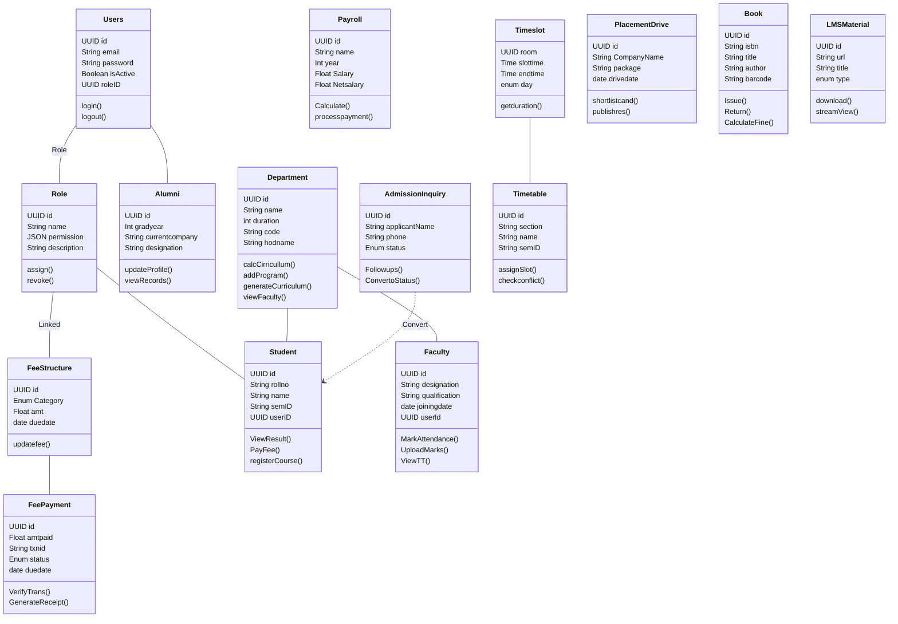

```mermaid
classDiagram
    %% Top Row
    class Users {
        UUID id
        String email
        String password
        Boolean isActive
        UUID roleID
        login()
        logout()
    }

    class Role {
        UUID id
        String name
        JSON permission
        String description
        assign()
        revoke()
    }

    class FeeStructure {
        UUID id
        Enum Category
        Float amt
        date duedate
        updatefee()
    }

    class FeePayment {
        UUID id
        Float amtpaid
        String txnid
        Enum status
        date duedate
        VerifyTrans()
        GenerateReceipt()
    }

    %% Second Row
    class Alumni {
        UUID id
        Int gradyear
        String currentcompany
        String designation
        updateProfile()
        viewRecords()
    }

    class Student {
        UUID id
        String rollno
        String name
        String semID
        UUID userID
        ViewResult()
        PayFee()
        registerCourse()
    }

    class Department {
        UUID id
        String name
        int duration
        String code
        String hodname
        calcCirricullum()
        addProgram()
        generateCurriculum()
        viewFaculty()
    }

    class Faculty {
        UUID id
        String designation
        String qualification
        date joiningdate
        UUID userId
        MarkAttendance()
        UploadMarks()
        ViewTT()
    }

    %% Third Row
    class AdmissionInquiry {
        UUID id
        String applicantName
        String phone
        Enum status
        Followups()
        ConvertoStatus()
    }

    class Payroll {
        UUID id
        String name
        Int year
        Float Salary
        Float Netsalary
        Calculate()
        processpayment()
    }

    class Timeslot {
        UUID room
        Time slottime
        Time endtime
        enum day
        getduration()
    }

    class Timetable {
        UUID id
        String section
        String name
        String semID
        assignSlot()
        checkconflict()
    }

    %% Fourth Row - Bottom
    class PlacementDrive {
        UUID id
        String CompanyName
        String package
        date drivedate
        shortlistcand()
        publishres()
    }

    class Book {
        UUID id
        String isbn
        String title
        String author
        String barcode
        Issue()
        Return()
        CalculateFine()
    }

    class LMSMaterial {
        UUID id
        String url
        String title
        enum type
        download()
        streamView()
    }

    %% Relationships and Layout Hints
    %% Connections as inferred from the hand-drawn sketch lines
    
    Users -- Role : Role
    Role -- FeeStructure : Linked
    FeeStructure -- FeePayment
    
    Users -- Alumni
    Role -- Student
    Department -- Student
    Department -- Faculty
    
    AdmissionInquiry ..> Student : Convert
    
    Timeslot -- Timetable
```
